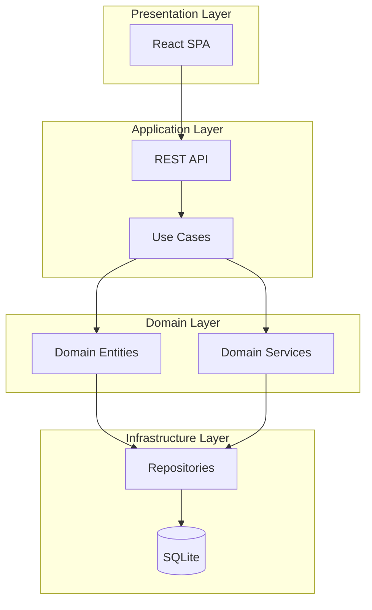
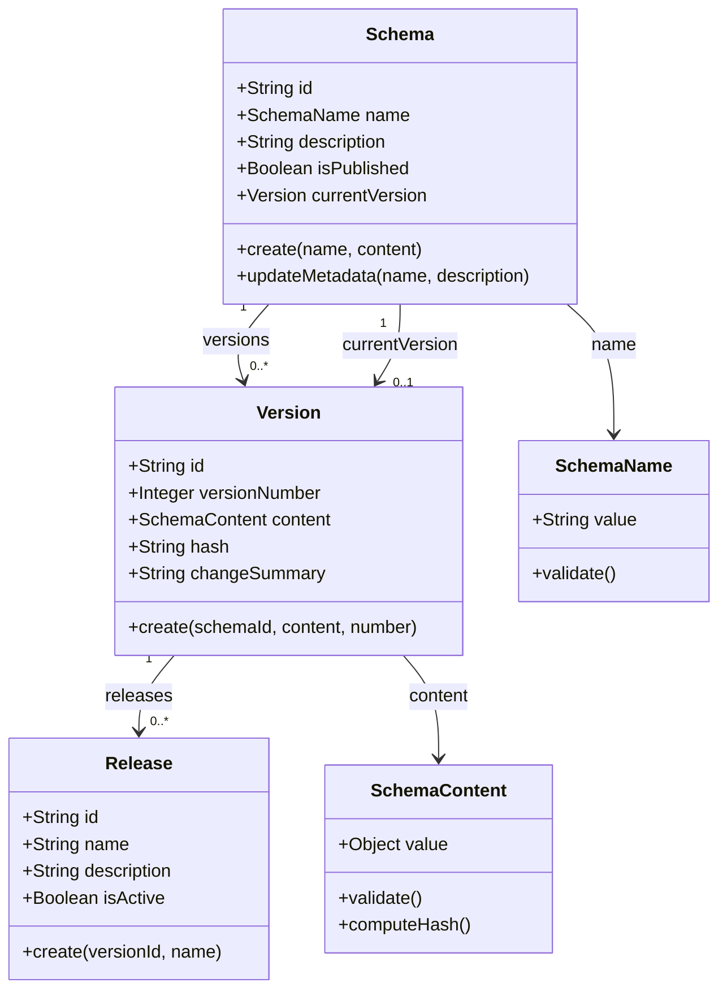

# Architecture Overview

## What is SchemaFlow?

SchemaFlow is a **Dynamic Form Schema Lifecycle Platform** for managing JSON Schema through its complete lifecycle:

```
Create Schema → Version → Diff → Release → Rollback
     ↑                              ↓
     └────────────── Update ←───────┘
```

## System Architecture



## Domain Model



## Component Responsibilities

### Domain Layer

| Component | Responsibility |
|-----------|----------------|
| `Schema` | Aggregate root, enforces name uniqueness |
| `Version` | Immutable content snapshot |
| `Release` | Version tagging for environments |
| `SchemaName` | Value object, validation rules |
| `SchemaContent` | Value object, content validation |

### Application Layer

| Use Case | Responsibility |
|----------|----------------|
| `CreateSchema` | Create schema + initial version |
| `UpdateSchema` | Update metadata only |
| `CreateVersion` | Add new version to schema |
| `CompareVersions` | Generate structured diff |
| `CreateRelease` | Tag version with name |
| `RollbackVersion` | Create version from previous |

### Infrastructure Layer

| Component | Technology |
|-----------|------------|
| REST API | Express.js |
| Repositories | Prisma ORM |
| Database | SQLite |
| Web UI | React + Tailwind |

## Data Flow

### Creating a Schema

```
1. Client POST /schemas
   ↓
2. Controller validates input
   ↓
3. CreateSchemaUseCase.execute()
   - Validate SchemaName
   - Check uniqueness
   - Create Schema aggregate
   - Create initial Version
   - Persist via Repository
   ↓
4. Return SchemaResponse
```

### Comparing Versions

```
1. Client GET /schemas/:id/diff?from=1&to=2
   ↓
2. Load Version 1 content
3. Load Version 2 content
   ↓
4. DiffEngine.compare(v1, v2)
   - Recursive object comparison
   - Detect added/removed/modified
   - Identify breaking changes
   ↓
5. Return DiffResult
```

## Key Decisions

| Decision | Rationale |
|----------|-----------|
| SQLite | MVP simplicity, easy setup |
| Immutable Versions | Audit trail, safe rollback |
| Sequential Version Numbers | Human-friendly communication |
| Separate Release Tags | One version, multiple environments |
| No Soft Delete | Simplicity, can add later |

## Constraints

- Max schema content: 100KB (text column)
- Max versions per schema: 1000
- Max releases per version: 100
- No authentication (MVP)
- Single user/tenant (MVP)
