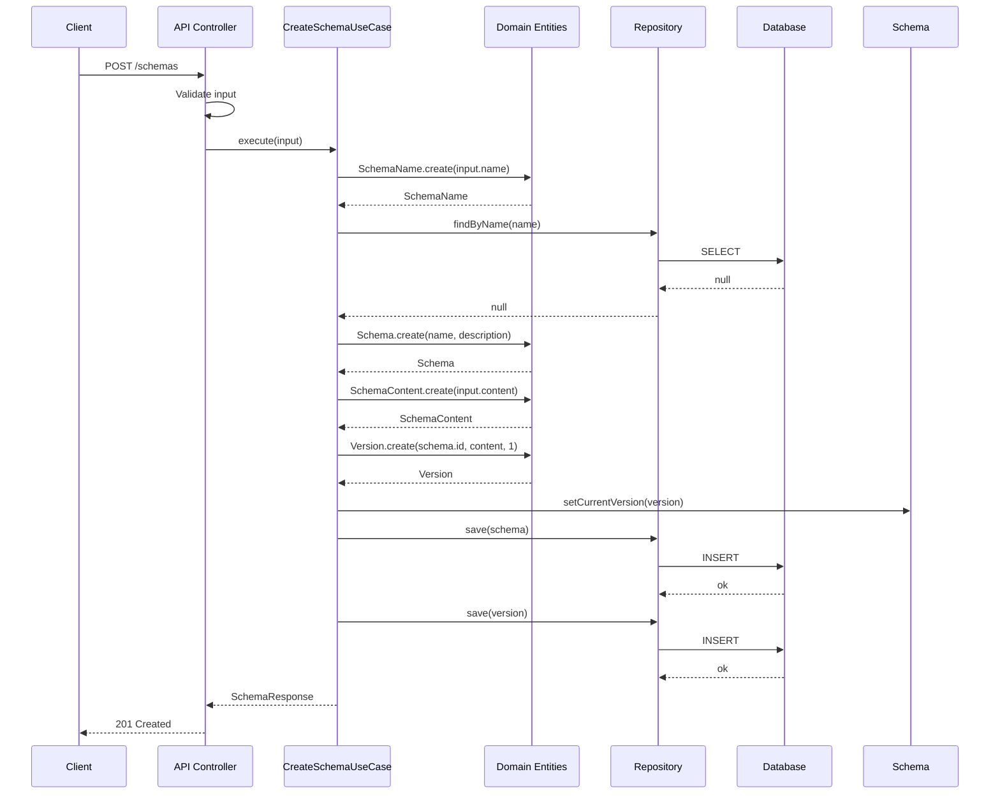
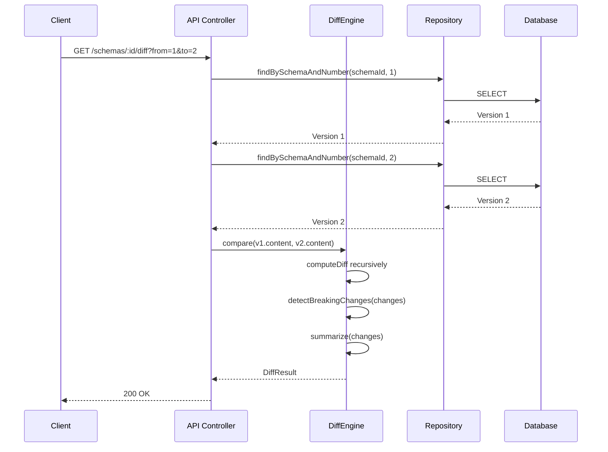
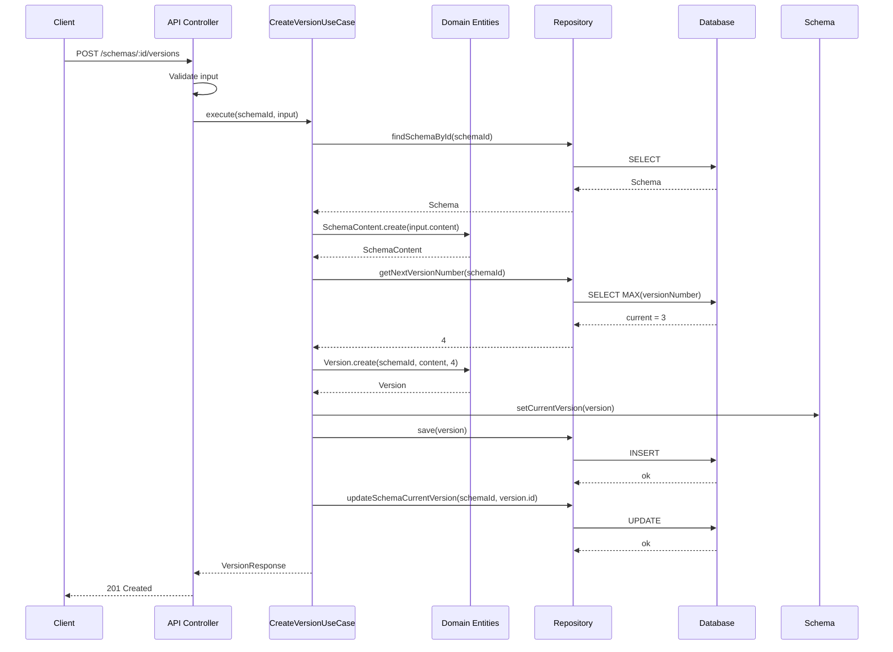
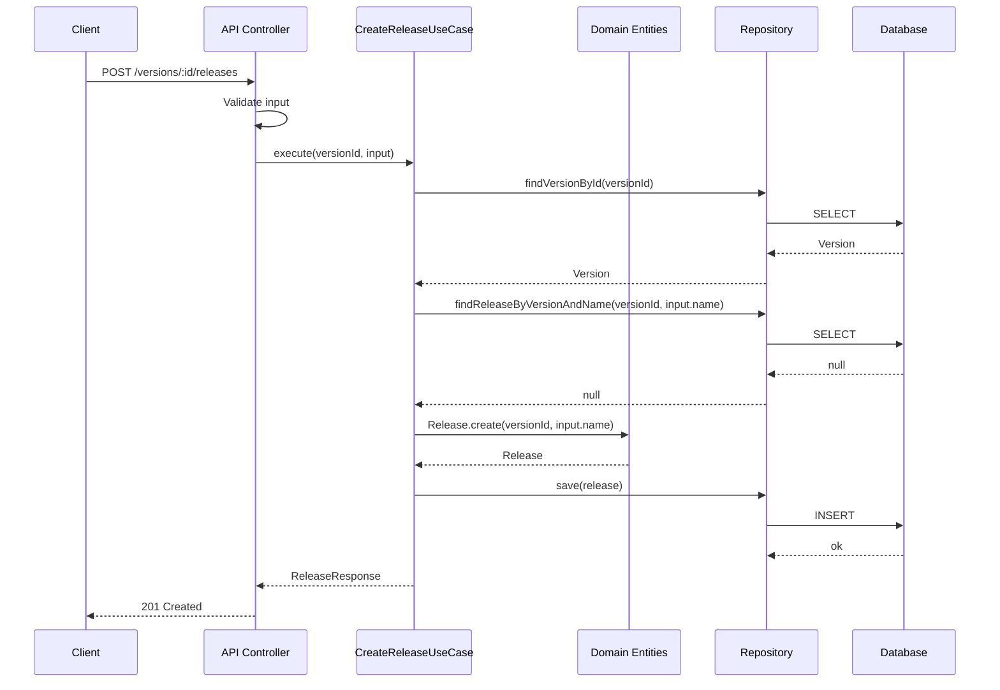
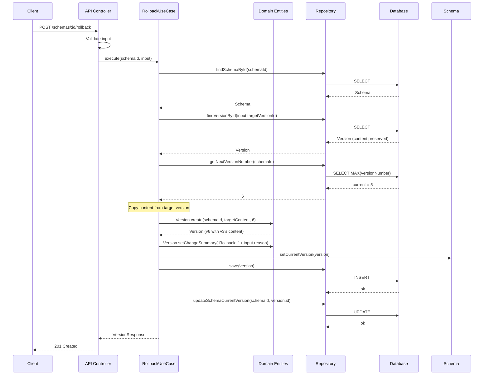
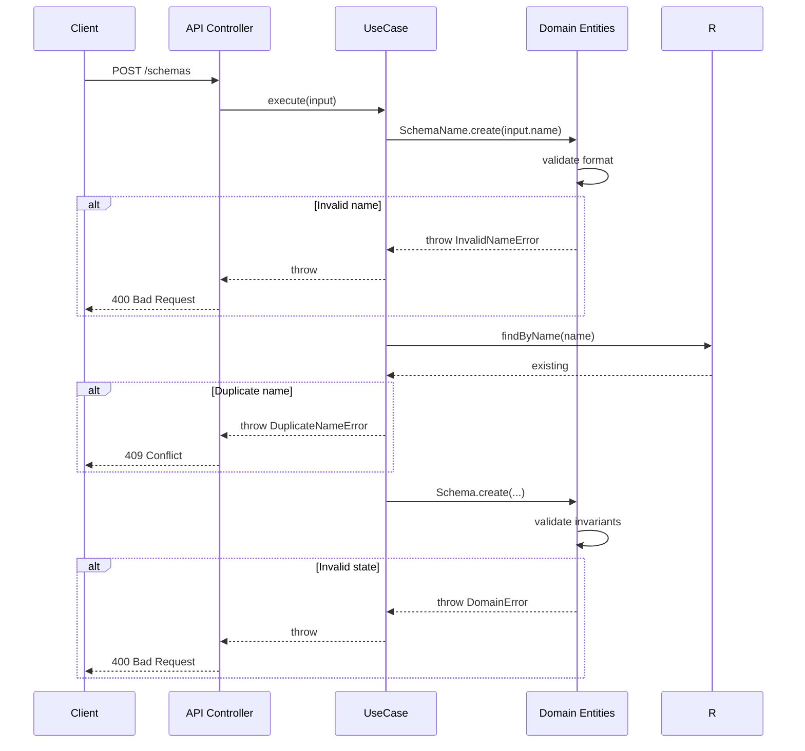
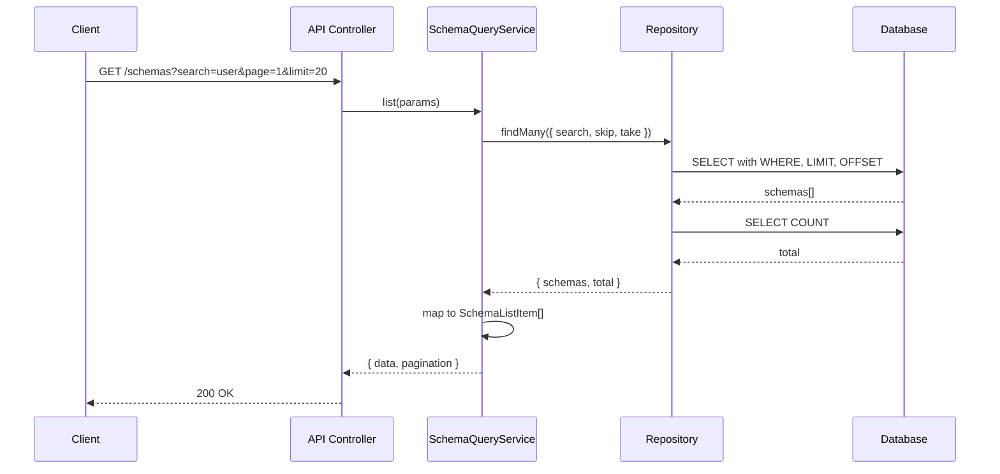

# Sequence Diagrams

## Create Schema Flow

```mermaid
sequenceDiagram
    participant C as Client
    participant API as API Controller
    participant UC as CreateSchemaUseCase
    participant DE as Domain Entities
    participant R as Repository
    participant DB as Database

    C->>API: POST /schemas
    API->>API: Validate input
    API->>UC: execute(input)
    
    UC->>DE: SchemaName.create(input.name)
    DE-->>UC: SchemaName
    
    UC->>R: findByName(name)
    R->>DB: SELECT
    DB-->>R: null
    R-->>UC: null
    
    UC->>DE: Schema.create(name, description)
    DE-->>UC: Schema
    
    UC->>DE: SchemaContent.create(input.content)
    DE-->>UC: SchemaContent
    
    UC->>DE: Version.create(schema.id, content, 1)
    DE-->>UC: Version
    
    UC->>Schema: setCurrentVersion(version)
    
    UC->>R: save(schema)
    R->>DB: INSERT
    DB-->>R: ok
    
    UC->>R: save(version)
    R->>DB: INSERT
    DB-->>R: ok
    
    UC-->>API: SchemaResponse
    API-->>C: 201 Created
```

## Compare Versions Flow

```mermaid
sequenceDiagram
    participant C as Client
    participant API as API Controller
    participant DE as DiffEngine
    participant R as Repository
    participant DB as Database

    C->>API: GET /schemas/:id/diff?from=1&to=2
    API->>R: findBySchemaAndNumber(schemaId, 1)
    R->>DB: SELECT
    DB-->>R: Version 1
    R-->>API: Version 1
    
    API->>R: findBySchemaAndNumber(schemaId, 2)
    R->>DB: SELECT
    DB-->>R: Version 2
    R-->>API: Version 2
    
    API->>DE: compare(v1.content, v2.content)
    
    DE->>DE: computeDiff recursively
    DE->>DE: detectBreakingChanges(changes)
    DE->>DE: summarize(changes)
    
    DE-->>API: DiffResult
    API-->>C: 200 OK
```

## Create Version Flow

```mermaid
sequenceDiagram
    participant C as Client
    participant API as API Controller
    participant UC as CreateVersionUseCase
    participant DE as Domain Entities
    participant R as Repository
    participant DB as Database

    C->>API: POST /schemas/:id/versions
    API->>API: Validate input
    API->>UC: execute(schemaId, input)
    
    UC->>R: findSchemaById(schemaId)
    R->>DB: SELECT
    DB-->>R: Schema
    R-->>UC: Schema
    
    UC->>DE: SchemaContent.create(input.content)
    DE-->>UC: SchemaContent
    
    UC->>R: getNextVersionNumber(schemaId)
    R->>DB: SELECT MAX(versionNumber)
    DB-->>R: current = 3
    R-->>UC: 4
    
    UC->>DE: Version.create(schemaId, content, 4)
    DE-->>UC: Version
    
    UC->>Schema: setCurrentVersion(version)
    
    UC->>R: save(version)
    R->>DB: INSERT
    DB-->>R: ok
    
    UC->>R: updateSchemaCurrentVersion(schemaId, version.id)
    R->>DB: UPDATE
    DB-->>R: ok
    
    UC-->>API: VersionResponse
    API-->>C: 201 Created
```

## Release Version Flow

```mermaid
sequenceDiagram
    participant C as Client
    participant API as API Controller
    participant UC as CreateReleaseUseCase
    participant DE as Domain Entities
    participant R as Repository
    participant DB as Database

    C->>API: POST /versions/:id/releases
    API->>API: Validate input
    API->>UC: execute(versionId, input)
    
    UC->>R: findVersionById(versionId)
    R->>DB: SELECT
    DB-->>R: Version
    R-->>UC: Version
    
    UC->>R: findReleaseByVersionAndName(versionId, input.name)
    R->>DB: SELECT
    DB-->>R: null
    R-->>UC: null
    
    UC->>DE: Release.create(versionId, input.name)
    DE-->>UC: Release
    
    UC->>R: save(release)
    R->>DB: INSERT
    DB-->>R: ok
    
    UC-->>API: ReleaseResponse
    API-->>C: 201 Created
```

## Rollback Flow

```mermaid
sequenceDiagram
    participant C as Client
    participant API as API Controller
    participant UC as RollbackUseCase
    participant DE as Domain Entities
    participant R as Repository
    participant DB as Database

    C->>API: POST /schemas/:id/rollback
    API->>API: Validate input
    API->>UC: execute(schemaId, input)
    
    UC->>R: findSchemaById(schemaId)
    R->>DB: SELECT
    DB-->>R: Schema
    R-->>UC: Schema
    
    UC->>R: findVersionById(input.targetVersionId)
    R->>DB: SELECT
    DB-->>R: Version (content preserved)
    R-->>UC: Version
    
    UC->>R: getNextVersionNumber(schemaId)
    R->>DB: SELECT MAX(versionNumber)
    DB-->>R: current = 5
    R-->>UC: 6
    
    Note over UC: Copy content from target version
    
    UC->>DE: Version.create(schemaId, targetContent, 6)
    DE-->>UC: Version (v6 with v3's content)
    
    UC->>DE: Version.setChangeSummary("Rollback: " + input.reason)
    
    UC->>Schema: setCurrentVersion(version)
    
    UC->>R: save(version)
    R->>DB: INSERT
    DB-->>R: ok
    
    UC->>R: updateSchemaCurrentVersion(schemaId, version.id)
    R->>DB: UPDATE
    DB-->>R: ok
    
    UC-->>API: VersionResponse
    API-->>C: 201 Created
```

## Error Handling Flow

```mermaid
sequenceDiagram
    participant C as Client
    participant API as API Controller
    participant UC as UseCase
    participant DE as Domain Entities

    C->>API: POST /schemas
    API->>UC: execute(input)
    
    UC->>DE: SchemaName.create(input.name)
    DE->>DE: validate format
    
    alt Invalid name
        DE-->>UC: throw InvalidNameError
        UC-->>API: throw
        API-->>C: 400 Bad Request
    end
    
    UC->>R: findByName(name)
    R-->>UC: existing
    
    alt Duplicate name
        UC-->>API: throw DuplicateNameError
        API-->>C: 409 Conflict
    end
    
    UC->>DE: Schema.create(...)
    DE->>DE: validate invariants
    
    alt Invalid state
        DE-->>UC: throw DomainError
        UC-->>API: throw
        API-->>C: 400 Bad Request
    end
```

## List Schemas Flow

```mermaid
sequenceDiagram
    participant C as Client
    participant API as API Controller
    participant QS as SchemaQueryService
    participant R as Repository
    participant DB as Database

    C->>API: GET /schemas?search=user&page=1&limit=20
    API->>QS: list(params)
    
    QS->>R: findMany({ search, skip, take })
    
    R->>DB: SELECT with WHERE, LIMIT, OFFSET
    DB-->>R: schemas[]
    
    R->>DB: SELECT COUNT
    DB-->>R: total
    
    R-->>QS: { schemas, total }
    
    QS->>QS: map to SchemaListItem[]
    
    QS-->>API: { data, pagination }
    API-->>C: 200 OK
```
